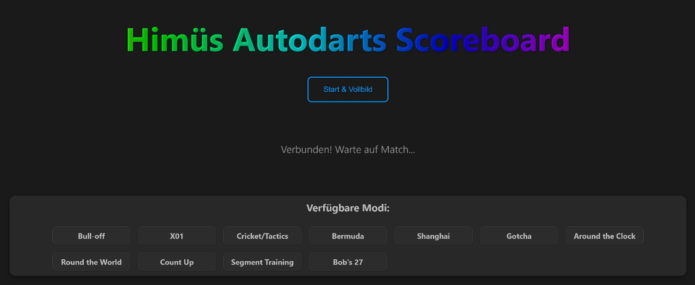
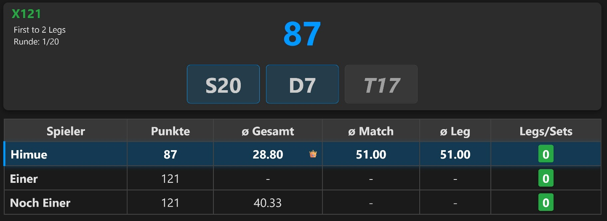
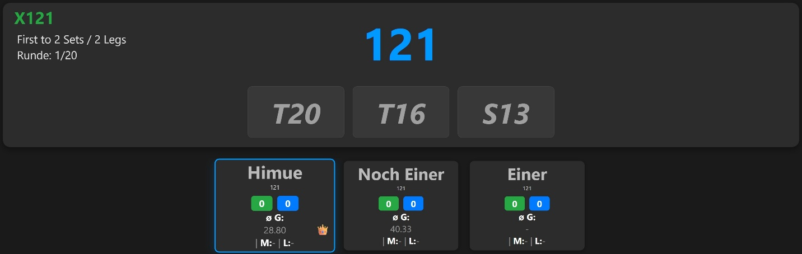
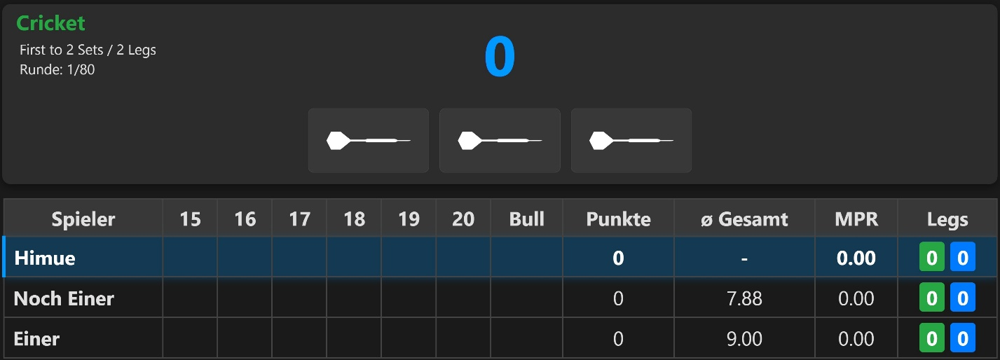
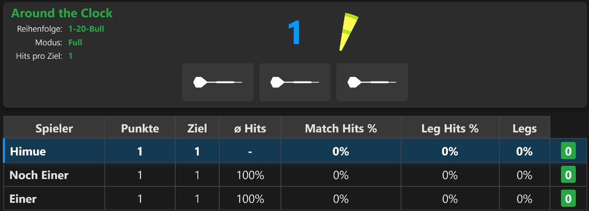

# 1 Himues Darts Scoreboard - Installationsanleitung

Herzlich willkommen! Diese Anleitung hilft Ihnen, das **Himues Darts
Scoreboard** auf Ihrem System zu installieren und zu konfigurieren.

# 2 Was ist das Himues Darts Scoreboard?

Das **Himues Darts Scoreboard** ist eine Webanwendung, die als
alternative, großformatige Anzeige für Ihre Autodarts-Spiele dient. Sie
wurde speziell dafür entwickelt, auf einem Fernseher oder einem größeren
Monitor im Browser zu laufen.

**Die Kernideen sind:**

-   **Fokus auf das Wesentliche:** Im Gegensatz zur Standard-Ansicht
    werden nur die für die Spieler wirklich relevanten Informationen
    (Spielstand, Averages, Würfe) groß und übersichtlich dargestellt.

-   **Unterstützung für viele Spielmodi:** Von X01 und Cricket bis hin
    zu Training-Spielen wie Segment Training passt sich die Anzeige
    automatisch an.

-   **Statistik-Erfassung:** Optional kann eine Datenbank angebunden
    werden, um langfristige Statistiken (Average, MPR, etc.) für alle
    Spieler – auch für Gäste – zu speichern und anzuzeigen.

# 3 Screenshoots

Startseite:

X01 in der Tabellen-Ansicht

X01 mit Spieler-Kartenanzeige

Cricket

Around The Clock mit Zielsegment-Anzeige

# 4 Installation (Empfohlene Methode für Linux mit systemd)

Diese Methode nutzt das beiliegende Installationsskript, das die meisten
Schritte für Sie automatisiert.

## 4.1 Voraussetzungen

-   Ein Computer mit einem **Debian-basierten Linux** (z.B. Debian,
    Ubuntu, Raspberry Pi OS).

-   Ein **normaler Benutzeraccount** mit sudo-Rechten. Führen Sie die
    Installation **nicht** direkt als root-Benutzer aus.

-   **Python 3.8** oder neuer.

-   **Git** muss installiert sein (sudo apt install git).

## 4.2 Installationsschritte

1.  **Projekt herunterladen:** Öffnen Sie ein Terminal und klonen Sie
    > das Projekt von GitHub:

&gt; git clone
https://github.com/andhimue/himues-autodarts-scoreboard.git  
**In das Verzeichnis wechseln:**

&gt; cd himues-autodarts-scoreboard

1.  **Installationsskript ausführen:** Starten Sie das Skript. Es wird
    > Sie durch den gesamten Prozess führen.

&gt; python3 install.py

1.  **Den Anweisungen folgen:**

    -   Das Skript prüft, ob notwendige Systempakete (z.B. für Python
        und die Datenbank) fehlen, und wird Sie fragen, ob es diese mit
        sudo installieren darf. Bestätigen Sie dies und geben Sie bei
        Aufforderung Ihr Passwort ein.

    -   Sie werden nach Ihren **Autodarts-Zugangsdaten** und Ihrer
        **Board-ID** gefragt.

    -   Sie werden gefragt, ob Sie die **Datenbank-Funktion** für
        Langzeit-Statistiken nutzen möchten. Wenn Sie "Ja" sagen, werden
        Sie nach den Zugangsdaten für Ihre MariaDB/MySQL-Datenbank
        gefragt.

    -   Anschließend können Sie wählen, ob die Konfiguration in einer
        .env-Datei oder direkt in der config.py gespeichert werden soll.
        Für die meisten Benutzer ist .env die empfohlene Wahl.

    -   Zuletzt werden Sie gefragt, ob die Anwendung als **automatischer
        Dienst** eingerichtet werden soll, damit sie bei jedem
        Systemstart von selbst läuft. Dies wird dringend empfohlen.

2.  **System neustarten:** Nach Abschluss der Installation wird ein
    Neustart des Systems empfohlen. Danach sind das Backend und Frontend
    automatisch gestartet.

Am Ende der Installation zeigt Ihnen das Skript die lokalen IP-Adressen
an, unter denen das Scoreboard im Browser erreichbar ist (z.B.
http://192.168.1.100:6002).

# 5 Manuelle Installation (Für andere Systeme oder Experten)

Falls Sie kein systemd verwenden (z.B. auf Windows) oder die
Installation manuell durchführen möchten, folgen Sie diesen Schritten.

## 5.1 Voraussetzungen

-   Stellen Sie sicher, dass **Python 3.8+** und das dazugehörige
    venv-Modul installiert sind.

-   Installieren Sie bei Bedarf manuell die Entwickler-Pakete für
    MariaDB/MySQL.

## 5.2 Installationsschritte

1.  **Projekt herunterladen** (siehe Schritt 2.2.1).

2.  **Virtuelle Umgebung (venv) erstellen:**

&gt; python3 -m venv venv

1.  **Venv aktivieren:**

    -   Linux/macOS: source venv/bin/activate

    -   Windows: .\\venv\\Scripts\\activate

2.  **Python-Pakete installieren:**

&gt; pip install -r requirements.txt

1.  **Konfiguration erstellen:**

    -   Wechseln Sie in das backend-Verzeichnis.

    -   Erstellen Sie eine Datei namens .env oder bearbeiten Sie die
        config.py.  
        Werte in .env überschreiben Werte in config.py

    -   Fügen Sie die notwendigen Konfigurationsvariablen hinzu (siehe
        Abschnitt 4).

<!-- -->

1.  **Manuelles Starten der Anwendung**

Da keine automatischen Dienste eingerichtet wurden, müssen Sie das
Backend und das Frontend manuell in **zwei separaten Terminals**
starten.

-   **Terminal 1 (Backend):**

&gt; cd /pfad/zum/projekt/backend

&gt; source ../venv/bin/activate

&gt;./start-prod.sh

-   **Terminal 2 (Frontend):**

&gt; cd /pfad/zum/projekt/frontend

&gt; source ../venv/bin/activate

&gt;./start-prod.sh

**Hinweis:** Die Dienste laufen nur, solange diese Terminals geöffnet
sind, und starten nicht automatisch mit dem System.

# 6 Konfigurationsmöglichkeiten (werden bei Nutzung des Installationsscripts aus Punkt 3 automatisch gesetzt)

## 6.1 Speicherort

Die Konfiguration wird im backend-Verzeichnis gespeichert. Das
Installationsskript fragt Sie, ob Sie eine .env-Datei oder die
config.py-Datei verwenden möchten.

-   **.env-Datei (empfohlen):** Sicherer und übersichtlicher. Werte hier
    überschreiben immer die Werte in der config.py.

-   **config.py:** Dient als Fallback und Vorlage.

## 6.2 Notwendige Einstellungen

Diese Werte müssen für den Betrieb zwingend konfiguriert werden:

-   AUTODARTS\_USER\_EMAIL

-   AUTODARTS\_USER\_PASSWORD

-   AUTODARTS\_BOARD\_ID

## 6.3 Optionale Datenbank-Einstellungen

Diese Werte sind nur relevant, wenn Sie die Statistik-Funktion nutzen
(USE\_DATABASE = True):

-   DB\_HOST, DB\_PORT, DB\_USER, DB\_PASSWORD, DB\_DATABASE

## 6.4 Weitere Einstellungen

In der backend/config.py-Datei können Sie weitere Details anpassen:

-   X01\_DISPLAY\_MODE: Ändert die Anzeige bei X01-Spielen zwischen
    einer Tabelle ('table') und einer kompakteren Kartenansicht
    ('cards').

-   RECONNECT\_MATCH\_MAX\_AGE\_HOURS: Legt fest, wie alt ein Spiel
    maximal sein darf (in Stunden), um bei einem Neustart des Backends
    wiederhergestellt zu werden.

# 7 Kurzerklärung des Sicherheits-Moduls

Die Anwendung benötigt zur Kommunikation mit den Autodarts-Servern einen
speziellen Satz von Schlüsseln (client\_id und client\_secret).

Um diese sensiblen Daten nicht öffentlich im Quellcode zu speichern,
verwendet die Anwendung standardmäßig einen sicheren Mechanismus
(Challenge-Response-Authentifizierung mittels HMAC): Sie kontaktiert
beim Start einen zentralen "Schlüssel-Server", um sich die für die
Laufzeit gültigen Schlüssel abzuholen.

Für maximale Flexibilität und als Backup-Möglichkeit wurde eine
**Fallback-Logik** implementiert:

-   Wenn Sie die Variablen AUTODARTS\_CLIENT\_ID und
    AUTODARTS\_CLIENT\_SECRET in Ihrer lokalen .env- oder
    config.py-Datei selbst eintragen, wird das Modul diese Werte
    bevorzugt verwenden und den externen Server nicht kontaktieren.

# 8 Gesamtdokumentation

Die Gesamtdokumentation des Projektes ist im Word-Dokument:
Projektdokumentation Himues Darts Scoreboard Vx.x.docx zu finden
